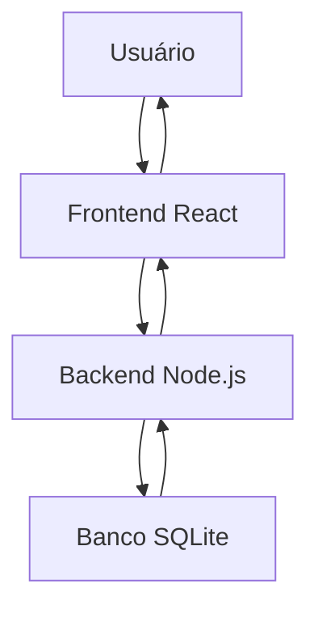

# Arquitetura do Sistema ESM Forum

## Identificação da Arquitetura

O sistema ESM Forum utiliza arquitetura cliente-servidor.

O frontend desenvolvido em React é responsável pela interface gráfica e comunicação com o backend.

O backend em Node.js realiza o processamento das regras de negócio e acesso ao banco de dados SQLite.

---

## Camadas Existentes

### Camada de Apresentação

Responsável pela interface com o usuário.

Tecnologias:
- React
- HTML
- CSS
- JavaScript

---

### Camada de Negócio

Responsável pelo processamento das funcionalidades do sistema.

Tecnologias:
- Node.js
- JavaScript

Exemplos:
- cadastro de perguntas
- cadastro de respostas
- busca de perguntas

---

### Camada de Dados

Responsável pelo armazenamento e consulta das informações.

Tecnologia:
- SQLite

---

## Comunicação entre Frontend e Backend

A comunicação ocorre através de requisições HTTP.

O frontend envia requisições para o backend, que processa os dados e retorna respostas em formato JSON.

---

## Fluxo de Dados

1. Usuário interage com o frontend
2. Frontend envia requisição HTTP
3. Backend processa a requisição
4. Backend consulta o banco de dados
5. Banco retorna os dados
6. Backend retorna resposta JSON
7. Frontend exibe os dados ao usuário

---

## Diagrama Arquitetural

