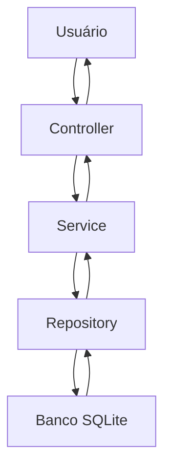

# Proposta de Organização Arquitetural

## Separação em Camadas

### Camada de Apresentação

Responsável pelas rotas da API e comunicação com o frontend.

Exemplos:
- rotas HTTP
- validação básica
- respostas JSON

Arquivos sugeridos:

- `routes/perguntas.js`
- `routes/respostas.js`

---

### Camada de Negócio

Responsável pelas regras de negócio do sistema.

Exemplos:
- validação de perguntas
- busca de perguntas
- contagem de respostas

Arquivos sugeridos:

- `services/PerguntaService.js`
- `services/RespostaService.js`

---

### Camada de Dados

Responsável pelo acesso ao banco de dados.

Exemplos:
- consultas SQL
- inserções
- atualizações

Arquivos sugeridos:

- `repositories/PerguntaRepository.js`
- `repositories/RespostaRepository.js`

---

## Comunicação entre Camadas

A camada de apresentação envia requisições para a camada de negócio.

A camada de negócio processa regras e utiliza a camada de dados para acessar o banco.

A camada de dados retorna informações para a camada de negócio, que responde para a apresentação.

---

## Aplicação do Padrão MVC

### Models

Responsáveis pelos dados e acesso ao banco.

Exemplos:
- Pergunta
- Resposta
- Usuário

---

### Views

Responsáveis pelas respostas JSON retornadas pela API.

Exemplo:

```json
{
  "id_pergunta": 1,
  "texto": "Como implementar busca?"
}
```

---

### Controllers

Responsáveis por controlar requisições e respostas.

Exemplos:
- cadastrar pergunta
- listar perguntas
- buscar perguntas

---

## Fluxo MVC

1. Usuário envia requisição
2. Controller recebe requisição
3. Controller chama Service
4. Service processa regras
5. Repository acessa banco
6. Dados retornam para Controller
7. Controller retorna JSON

---

## Diagrama MVC


